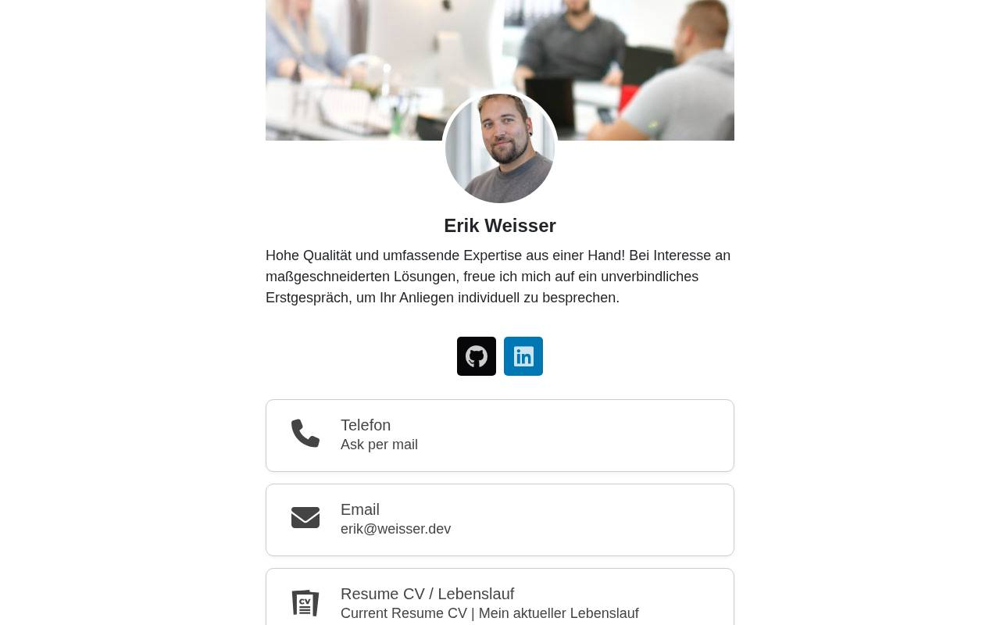

# weisser.dev

Personal digital business card of Erik Weisser, built with the open-source [my-digital-card](https://github.com/weisser-dev/my-digital-card) template.

**Live:** [weisser.dev](https://weisser.dev)



## Features

- Profile image, header image, short bio and social links
- Contact and link cards, configured via JSON data files
- Light, dark and custom color themes (`src/colorThemes/`)
- Optional encoding of the profile data (`encodeProfileData` in `src/config/config.json`)

## Tech stack

React 18, TypeScript, Vite.

## Run locally

```bash
npm install
cp src/data/profileData.template.json src/data/profileData.json   # then edit your data
npm start          # dev server (Vite)
npm run build      # production build into build/
npm test           # prebuild + TypeScript type check
```

## Deployment

`.github/workflows/deploy.yml` runs on every push to `main`: install, type check, build and publish of `build/` to the `gh-pages` branch (GitHub Pages).

## License

See [LICENSE](LICENSE).
